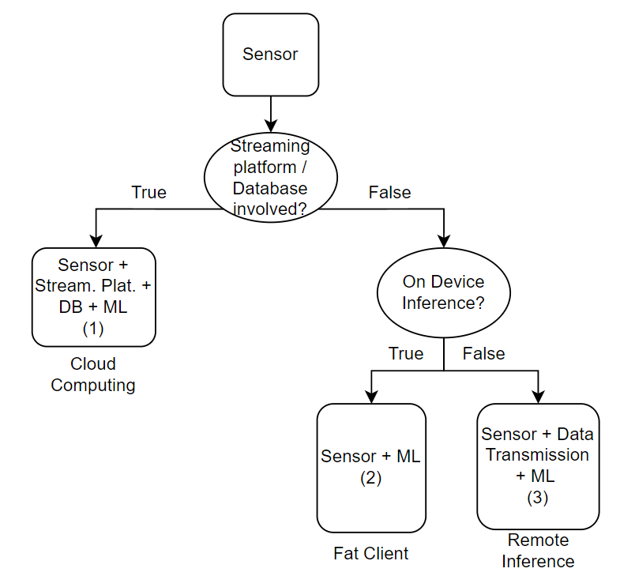
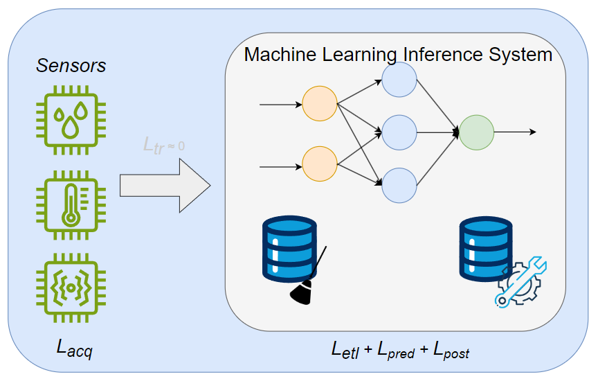
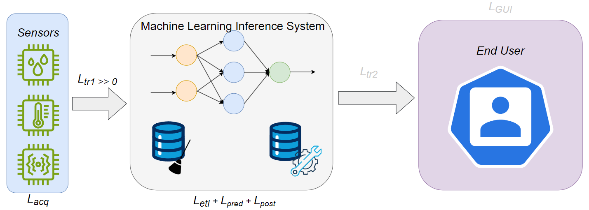
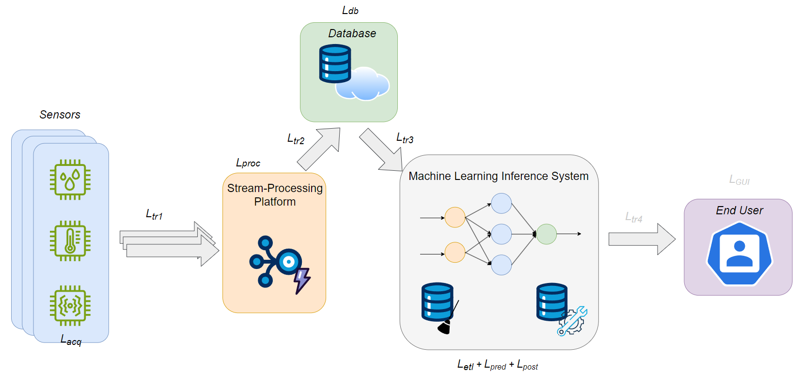

# FLUX: Feedback Latency and Utilization Examination for Real-Time Sensor-Based AI Pipelines

A master thesis in analyzing all possible factors and optimization techniques that affect the latency in a generic ML inference pipeline with sensor data streams as input.

## Structure
```
FLUX

|-KNN: Simple machine learning model that usus K-Nearest Neighbour (deprecated)

|-Receivers: Contains receivers used with different protocols (deprecated)
 |-receiver_http.py: Use http, IPV4 and TCP as 
 protocol
 |-receiver_mqtt.py: Use MQTT(IoT) as protocol
 |-receiver_ws.py: Use Websockets as protocol

|-Senders: Contains senders that streams metadata and images
 |-sender_yolo_fat.py: Used in Fat Client(deprecated)
 |-sender_yolo_http.py: Used in Remote Inference with HTTP as the transmission protocol
 |-sender_yolo_kafka.py: Used in Cloud Computing
 |-sender_yolo_mqtt.py: Used in Remote Inference with MQTT as the transmission protocol
 |-sender_yolo_scale.py: Used in Remote Inference with multiple senders(scalability sender side)
 |-sender_yolo_udp.py: Used in Remote Inference with raw UDP as the transmission protocol

|-SQL: Contains sql helper functions
 |-buffer_data.py: Saves intermediate results into a json file
 |-create_sql.py: Create a SQL dataschema in the given database
 |-crud.py: Performs CRUD actions
 |-db.py: Init SQL connections
 |-model.py: Defines SQL model schema
 |-save_data.py: Saves records in json file into SQL database 

|-YOLO: Contains YOLO, the computer vision model
 |-cloud.py: Used for cloud computing setup
 |-csfy_2.py: Used for Fat Client setup
 |-csfy_threads_new.py: Used for Fat Client setup with multiple inference workers(scalability receiver side)
 |-http.py: Used for Remote Inference with HTTP as the transmission protocol
 |-mqtt.py: Used for Remote Inference with MQTT as the transmission protocol
 |-udp.py: Used for Remote Inference with raw UDP as the transmission protocol
 |-kafka.py: Used for Cloud Computing

|-ntp.py: Clock time synchronization
```
## Scenario
We categorize any machine learning inference pipeline with sensor data stream as input into the following categories based on components

### 1. Fat Client

### 2. Remote Inference

### 3. Complex Setup


## Latency Formula
We denote the latency in the stage of sensor data acquisition as $L_{acq}$, data stream transmission: $L_{tr}$, data storage and retrieval: $L_{db}$ and data processing: $L_{proc}$.
Similarly, we denote the latency in the four stages of machine learning inference pipeline as data ingestion and data preprocessing: $L_{etl}$ (which stands for the extraction, transform and load process), 
prediction generation: $L_{pred}$ 
and post processing: $L_{post}$. Additionally, there could exist latency from the end-user side, denoted as $L_{GUI}$.
Then, considering all the factors, the overall latency can be expressed as:
\begin{equation}
    \textbf{$L$} = \textbf{$L_{acq}$} + \textbf{$L_{tr}$} + \textbf{$L_{db}$} + \textbf{$L_{proc}$} + \textbf{$L_{etl}$} + \textbf{$L_{pred}$} + \textbf{$L_{post}$} [+ \textbf{$L_{GUI}$}]
\end{equation}
Depending on the specific scenario, components of this equation such as \textbf{$L_{tr}$}, may appear multiple times. We denote them as \textbf{$L_{tr1}$}, \textbf{$L_{tr2}$} and so forth.
Futhermore in fat client scenario, we don't have any data stream transmission latency, thus \textbf{$L_{tr}$} = 0.
### 1. Fat Client
$$
 \textbf{$L$} = \textbf{$L_{acq}$} + \textbf{$L_{etl}$} + \textbf{$L_{pred}$} + \textbf{$L_{post}$}
$$
### 2. Remote Inference
$$
\textbf{$L$} = \textbf{$L_{acq}$} + \textbf{$L_{tr1}$}  + \textbf{$L_{etl}$} + \textbf{$L_{pred}$} + \textbf{$L_{post}$} [+ \textbf{$L_{tr2}$} + \textbf{$L_{GUI}$}]
$$
### 3. Complex Setup
$$
\textbf{$L$} = \textbf{$L_{acq}$} + \sum_{i=1}^{3}\textbf{$L_{tri}$} + \textbf{$L_{db}$} + \textbf{$L_{proc}$} + \textbf{$L_{etl}$} + \textbf{$L_{pred}$} + \textbf{$L_{post}$} [+ \textbf{$L_{tr4}$} + \textbf{$L_{GUI}$}]
$$
## External Tools
